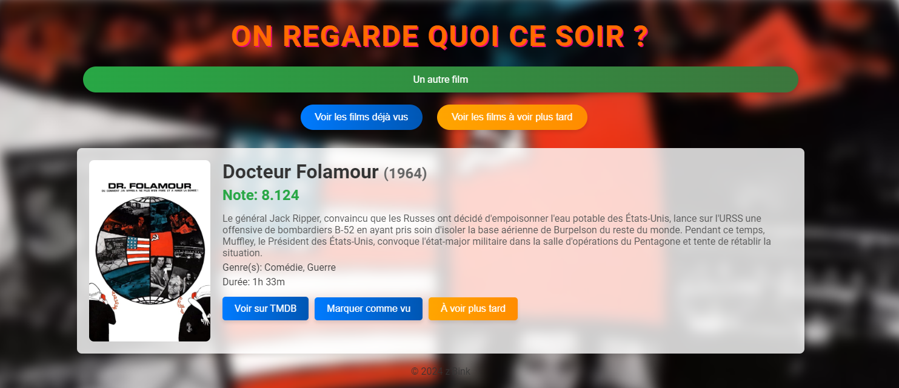

# Création d'une application web 

Pour mettre en pratique les compétences acquises au cours de ma formation, j'ai créé une application web utilisant une base de données publique. 
Cette application permet de sélectionner des films de manière aléatoire parmi les mieux notés et les plus populaires de la base de données TMDB. 
Elle répond à une question que l'on se pose souvent : "Qu'est-ce qu'on regarde ce soir ?" sans avoir à effectuer de tri ou à naviguer sur différents sites internet. 

**Vous pouvez tester l'application [ICI](https://kevinrajon.fr/film)**

### Etapes de developpement
  - Récupération d'un clé API
  - Création de la requête GET ([documentation](https://developer.themoviedb.org/reference/discover-movie))
  - Test de la requête avec Postman
  - Création de l'interface HTML/CSS
  - Création d'un script JS
  - Ajout de fonction (film déja vus/film à voir plus tard)
  - Amélioration du design

### Voici le résultat final 

